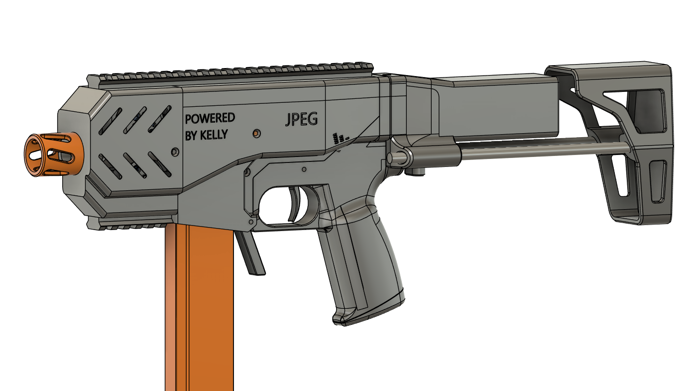
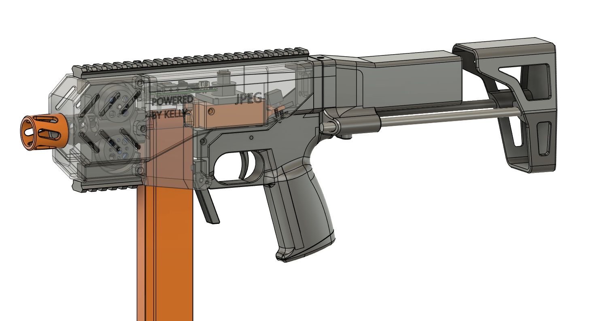

## JPEG
This is my(RPI's) brushless competition blaster with all the bells and whistles of the best.

## THIS BLASTER IS CURRENTLY IN AN OPEN BETA. THE FILES ARE FUNCTIONAL BUT NOT GUARANTEED TO BE FINAL.  DM me on discord (jougheaux) if you have questions.

## Pictures

Updates (Click here)

 --------------------------------------
 - Koda support w. changes to magwell and mag retention
 - Elongated pusher for reliable feeding with 36mm workers
 - changed pusher construction (removed wedge)
 - removed feed lips from cage inner
 --------------------------------------
 - Stock Base & Battery Tray changed to have easier access to the battery
 - Lower changed to allow battery in grip and better printing
 - Grip bottom changed to allow battery in grip
 - Mag retention changed to have less slop
 - Magwell changed to no longer hold the selector switch
 - Pusher Body changed to hold the selector switch
 - Motor Housing changed for better wire routing
 - Wheels changed for smaller geometry
 - Cage became Cage Body and Cage Inner to allow for better printing
 - Muzzle is now threaded
 - Shroud has a slightly smaller opening in front
 - Added files for serialized grips and parametric cages/bcars
 --------------------------------------
 - adjusted heat set insert tolerance
 - uploaded wiring diagram (https://docs.google.com/document/d/1IgKOaXz1Wq1czSlrQZNBrS4rJvw-7m4BnzTXSQHMin8/edit)
--------------------------------------
- selectfire pictograph on magwell
- assembly guide added here (https://docs.google.com/document/d/1t8XXDXZycTl_3nRU9CUnI02HiXrD-tiSQikEmLgy0f4/edit)
--------------------------------------
- minor tweaks to: pusher body, wedge, stock base, stock mech plate, muzzle, shroud
- firmware now allows for 100, 130, and 200 fps options from the selector switch on boot up
- build guide coming soon
--------------------------------------
- v0.2 greatly reduces support material needed to print this blaster, v0.1.1 files are there for people who started printing
- Firmware is more reliable
- Print guide outlined on the second page of BOM (https://docs.google.com/spreadsheets/d/1kkiYsIlRcB7tAiH2ZU5NDMiAzAqcHJNqWwJKifN7Q3Q/edit#gid=0  )

## Features

- 193fps average, 207 max, standard deviation <10
- Brushless
- BCAR
- Selectfire
- Pre-wheel bearing guide
- Runs on KellyIndustries Dettlaff and Plusmotors
- Machined impeller wheels from Roboman

## Instructions
- [Print guide](https://docs.google.com/spreadsheets/d/1kkiYsIlRcB7tAiH2ZU5NDMiAzAqcHJNqWwJKifN7Q3Q/edit#gid=258203420)
- [Wiring guide](https://docs.google.com/document/d/1IgKOaXz1Wq1czSlrQZNBrS4rJvw-7m4BnzTXSQHMin8/edit)
- [Assembly guide](https://docs.google.com/document/d/1t8XXDXZycTl_3nRU9CUnI02HiXrD-tiSQikEmLgy0f4/edit)
- Grip bottom is serialized so ask me for available numbers (I'll probably make a spreadsheet to claim if there's enough people making them)  

## Hardware List  
Parts cost about $175, total cost higher if buying sets of screws  
[Hardware List](https://docs.google.com/spreadsheets/d/1kkiYsIlRcB7tAiH2ZU5NDMiAzAqcHJNqWwJKifN7Q3Q/edit#gid=0)  
Note: the worker stock is optional, however,  it is designed to only fit that stock.

## Thank Yous
I was the one working on the CAD, but this couldn't have been done without the efforts of the "RPI Nerf Industrial Complex" and members of the nerf community.
- Adrian Kelly/ KellyIndustries supplied their new [plus motors](https://kellyindustries.us/collections/flywheel-parts/products/plus-motor-brushless) and [Dettlaff](https://kellyindustries.us/collections/flywheel-parts/products/dettlaff-brushless-blaster-controller) along with creating the bruxa, which JPEG's pusher is based on (and the [Kellyindustries discord](https://discord.gg/gnhjt6QDAX) for helping troubleshoot)
- [Raymond Chien](https://www.linkedin.com/in/raymond-chien-1a0341229?original_referer=https%3A%2F%2Fwww.google.com%2F) for giving me parts and designs to work off of and for being a meme lord
- [Brad](https://thefactoryamsterdam.com/) [Roboman](https://roboman.net/) for giving me  bearings and being a cool dude
- [Gavinfuzzy](https://www.etsy.com/shop/GavinfuzzyCustoms) for giving me CAD for the worker stock from the SBL
- Mike Farley and Mathew Davis for helping guide aesthetics and design language
- RPI HVZ community for providing feedback and help

## To Do
- Solenoid version (pusher body can be repurposed to have a solenoid mount I just need to do CAD) (Eli Wu if you're reading this can I have one please)

## Licensing
 This work is licensed under a <a rel="license" href="http://creativecommons.org/licenses/by-nc-sa/4.0/">Creative Commons Attribution-NonCommercial-ShareAlike 4.0 International License</a>.
