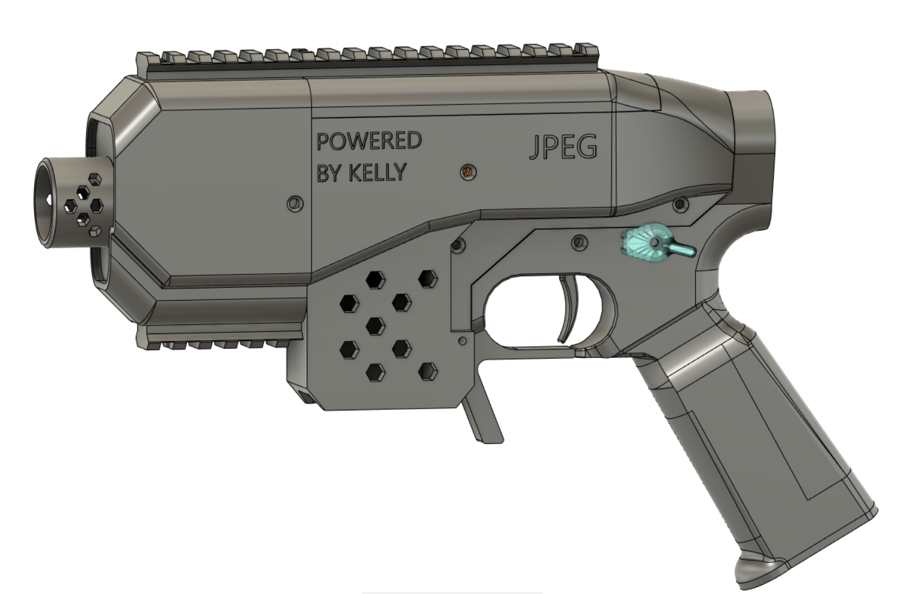
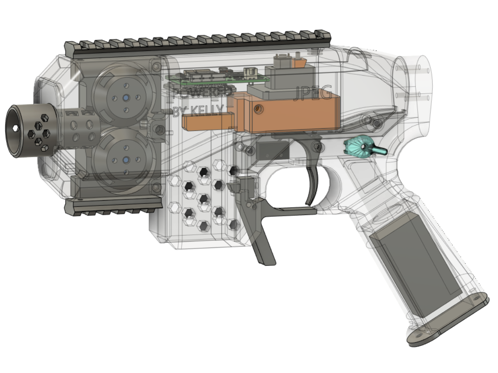

## JPEG
This is my brushless competition blaster with all the bells and whistles of the best.

## THIS IS NOT A FULL RELEASE NOR IS THIS BLASTER TESTED. I WILL UPDATE THIS WILL ACTUAL INFORMATION ONCEC TEST PRINTS CONCLUDE

## Pictures

## Features

- This will be a list of features
- Brushless
- BCAR
- Selectfire
- Pre-wheel bearing guide

## Hardware List
Kellytime (Detlaff, Plusmotor)

## Licensing
 This work is licensed under a <a rel="license" href="http://creativecommons.org/licenses/by-nc-sa/4.0/">Creative Commons Attribution-NonCommercial-ShareAlike 4.0 International License</a>.
